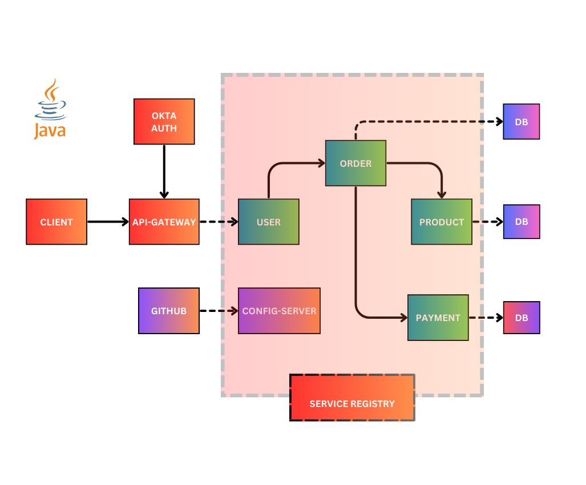

### SpringBoot-Google-Cloud-Platform-Microservices

#### Project Configurations
- SpringBoot microservices for `google cloud platform` with `kubernetes` incorporates order, product and payment services.
- A config-server for common properties on `GITHUB`, `eureka service` and an `API gateway` with spring security.
- Config-Server on GITHUB: https://github.com/lawrencejews/gcp-microservices-config-server/tree/main
- Circuit Breakers for services down `spring-cloud-starter-circuitbreaker-reactor-resilience4j` and Call Rate Limiter `docker run --name latestredis -d -p6379:6379 redis`
- Zipkin Docker command: `docker run -d -p 9411:9411 openzipkin/zipkin`
#### Okta Auth 
- User Login API is created in the API-GATEWAY where it hits the Okta Auth for Authorization and Authentication.
- Register your application with developer edition okta `https://developer.okta.com/docs/guides/`.
- Sign-in user-redirect uri: `http://localhost:9090/login/oauth2/code/okta`or `http://localhost:8080/authorization-code/callback`
- Sign-out user-redirect uri: `http://localhost:9090/login/oauth2/code/okta`
- Get your Client ID`0oagrqqyXXXXXXXXXX` and Cient Security `X1d969NDkiVrDEXY6Eg8-XXXXXXXXXXXXXXXXXXX`.
- Go to Okta security API for the authorization server issuer URI and determine which scope to use.
- Define GROUPS  for Admin and Customer -> PEOPLE attached to groups then -> use them in claims-security tab.
- `NOTE`: Create a new claim for the project by attaching the created groups.
- Add SpringBoot dependencies for okta ` <artifactId>okta-spring-boot-starter</artifactId>` and spring security `<artifactId>spring-boot-starter-security</artifactId>` .
#### Unit Testing - JUNIT
- Mockito: vital role in developing testable applications.
- wireMock: Create stable test and development environments, isolate yourself from flakey 3rd parties and simulate APIs that don’t exist yet.
- TODO
#### Docker, DockerCompose & Kubernetes for SpringBoot
- Build the microservice `mvn clean install`
- Create a Dockerfile, Build the Image and Tag`docker build -t lawrencejews/gcp-service-registry:latest .`
- Run the image `docker run -d -p 8761:8761 --name gcp-service-registry IMAGE ID`
- `NOTE:` Config-server `docker run -d -p 9296:9296 -e EUREKA_SERVER_ADDRESS=http://host.docker.internal:8761/eureka --name gcp-config-service IMAGE ID `
- `NOTE:` Api-gateway `docker run -d -p 9090:9090 -e CONFIG-SERVER_URL=host.docker.internal -e EUREKA_SERVER_ADDRESS=http://host.docker.internal:8761/eureka --name gcp-api-service IMAGE ID`
- Push the image to dockerhub `docker push lawrencejews/gcp-service-registry:latest`
- Docker-compose run `docker-compose -f docker-compose.yml up -d` and Remove `docker-compose -f docker-compose.yml remove`
##### Maven JIB 
- Jib is a Maven plugin for building Docker and OCI images for your Java applications.
- Run the build command `mvn clean install jib:build`
```
<project>
    <build>
        <plugins>
            <plugin>
                <groupId>com.google.cloud.tools</groupId>
                <artifactId>jib-maven-plugin</artifactId>
                <configuration>
                    <from>
                        <image>openjdk:11</image>
                    </from>
                    <to>
                        <image>registry.hub.docker.com/lawrencejews/gcp-service-registry</image>
                        <tags>${project.version}</tags>
                    </to>
                </configuration>
            </plugin>
        </plugins>
    </build>
</project>    
```
#### Kubernetes 
Kubernetes is an open source container orchestration engine for automating deployment, scaling, and management of containerized applications. The open source project is hosted by the Cloud Native Computing Foundation
`https://kubernetes.io/docs/home/`
- StatefulSets: Sticky Identity -> Manages the deployment and scaling of a set of Pods, and provides guarantees about the ordering and uniqueness of these Pods
- `NOTE`: Docker images were built locally -> use your images for any project that provisions resources with kubernetes.
- Deployment of kubernetes resources -> run `kubectl apply -f <FOLDER_NAME>`
- Delete deployed resources -> run `kubectl delete -f <FOLDER_NAME>`
- You can start the kubernetes dashboard with `minikube dashboard`
- Expose the service-load-balancer tunnel with minikube for eureka server `minikube service <LOADBALANCER>`
- Expose the API-Gateway with minikube -> a `REDIRECT-URL` for OKTA to access the services `minikube service <API_GATEWAY-SVC>`
- Expose the zipkin load-balancer `minikube service <ZIKPIN-LOADBALANCER>`
- Kubernetes service utilization instead of eureka service -> changes in the API-GATEWAY `uri: http://order-service-svc` 

#### Google Cloud - GCP and Jenkins
Google Cloud is a public cloud vendor with a set of physical assets, such as computers and hard disk drives, and virtual resources, such as virtual machines (VMs), that are contained in data centers around the globe.
- URL:`https://cloud.google.com/docs/overview`
- Create a project, billing plan
- Create a Docker Artifact Repository in google cloud and a Jenkins-Virtual machine for CI/CD operation in Compute Engine.
- Open the Compute Engine VM and install dependencies:`sudo apt-get install openjdk-11-jdk`, then add jenkins
```
curl -fsSL https://pkg.jenkins.io/debian-stable/jenkins.io.key |
sudo tee \
/usr/share/keyrings/jenkins-keyring.asc > /dev/null
echo deb [signed-by=/usr/share/keyrings/jenkins-keyring.asc] \
https://pkg.jenkins.io/debian-stable binary/ | sudo tee \
/etc/apt/sources.list.d/jenkins.list > /dev/null

sudo apt-get update

sudo apt-get install jenkins

```
- Install git `sudo apt-get install git` and kubectl `sudo apt-get install kubectl` in the Compute Engine VM
- Create a cloud NAT gateway for the instance `NOTE: create a router for the gateway` then create firewall rules for ingress traffic for jenkins-CI/CD pipeline.
- Jenkins will require a password that u can find on the provided path `sudo cat /var/lib/jenkins/secrets/initialAdminPassword` then u can be able to install jenkins plugins. Remember to create a user, config git path and maven in jenkins then add managed settings for github.
- Create a service account for kubernetes on google cloud from `IAM and Admin` and add it to jenkins for the google kubernetes plugins then upload the key generated from `IAM and Admin`
- Create the kubernetes clusters `autopilot` and add environment variables in jenkins.
- Add a github web-hooks on your project for jenkins.
- The `ms-initial-setup` folder will contain `config-maps`, `mysql-deployment`, `redis-deployment` and `zipkin-deployment` used for a mono-repo config for large projects for service to be deployed on the cloud
- All services are split into different repos on github with individual jenkins pipelines configurations and github web-hooks.
- PDF for installing sonar and postgresSQL on google compute engine project_vm.